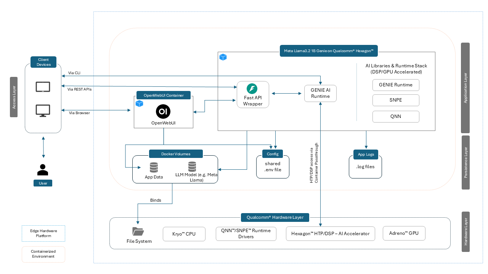

[//]: # (![Advantech Logo]&#40;../data/images/Advantech_logo.png&#41;)

# Meta Llama3.2 1B Genie on Qualcomm® Hexagon™

**Version:** 1.0  
**Release Date:** Aug 2025  
**Copyright:** © 2025 Advantech Corporation. All rights reserved.

## Overview

The `Meta Llama3.2 1B Genie on Qualcomm® Hexagon™` container image integrates GENIE, enabling streamlined on-device execution of generative AI model Meta Llama 3.2 1B. GENIE utilizes QNN backend, providing a hardware-accelerated environment for efficient conversational AI deployment. The containerized setup
includes OpenWebUI for an intuitive chat interface and leverages the Meta Llama model for fast, low-latency on-device
inference. This fully integrated environment is tailored for edge applications, ensuring high performance, real-time
responsiveness, and reliable offline AI interactions.

## Key Features

| Feature                         | Description                                                                                   |
|---------------------------------|-----------------------------------------------------------------------------------------------|
| **Complete AI Framework Stack** | QNN SDK (QNN, SNPE), GENIE                                                                    |
| **Integrated OpenWebUI**        | Clean, user-friendly frontend for LLM chat interface                                          |
| **Meta Llama 3.2 1B Inference** | Efficient on-device LLM, minimal memory, high performance                                     |
| **REST API Access**             | Simple local HTTP API for model interaction                                                   |
| **Flexible Parameters**         | Adjust inference with `max-num-tokens` `temperature`, `seed`, `top-p` `top_k`, `greedy`, etc. |
| **FastAPI Middleware**          | Python-based web server that provides an OpenAI-compatible endpoint for LLMs.                 |
| **Offline Capability**          | Fully offline after container image setup; no internet required                               |

## Architecture



## Hardware Specifications

| Component       | Specification                                                                                                                                      |
|-----------------|----------------------------------------------------------------------------------------------------------------------------------------------------|
| Target Hardware | [Advantech AOM-2721](https://www.advantech.com/en/products/a9f9c02c-f4d2-4bb8-9527-51fbd402deea/aom-2721/mod_f2ab9bc8-c96e-4ced-9648-7fce99a0e24a) |
| SoC             | [Qualcomm® QCS6490](https://www.advantech.com/en/products/risc_evaluation_kit/aom-dk2721/mod_0e561ece-295c-4039-a545-68f8ded469a8)                 |
| GPU             | Adreno™ 643                                                                                                                                        |
| DSP             | Hexagon™ 770                                                                                                                                       |
| Memory          | 8GB LPDDR5                                                                                                                                         |

## Operating System

This container is intended for **QCOM Robotics Reference Distro with ROS**, version **1.3-ver.1.1** OS running on
QCS6490 device.

| Environment     | Operating System                                    |
|-----------------|-----------------------------------------------------|
| **Device Host** | QCOM Robotics Reference Distro with ROS 1.3-ver.1.1 |
| **Container**   | Ubuntu 22.04 LTS                                    |

## Software Components

The following software components are available in the base image:

| Component                                                                                   | Version   | Description                                                                             |
|---------------------------------------------------------------------------------------------|-----------|-----------------------------------------------------------------------------------------|
| [SNPE](https://docs.qualcomm.com/bundle/publicresource/topics/80-70014-15B/snpe.html)       | 2.32.0    | Qualcomm® Snapdragon Neural Processing Engine; optimized runtime for Snapdragon DSP/HTP |
| [QNN](https://docs.qualcomm.com/bundle/publicresource/topics/80-63442-50/introduction.html) | 2.32.0    | Qualcomm® Neural Network (QNN) runtime for executing quantized neural networks          |
| Python                                                                                      | 3.10.12   | Python runtime for building applications                                                |
| Genie Runtime                                                                               | 1.6.0 | lightweight Qualcomm runtime for executing optimized large language models |

The following software components/packages are provided further as a part of this image:

| Component         | Version | Description                                                                                                                             |
|-------------------|---------|-----------------------------------------------------------------------------------------------------------------------------------------|
| FastAPI           | 0.116.1 | FastAPI is a modern, fast (high-performance), web framework for building APIs with Python based on standard Python type hints           |
| OpenWebUI         | 0.6.5   | Provided via seprate OpenWebUI container for UI                                                                                         |

## Supported AI Capabilities

### LLM Models

| Model             | Format | Note                                                          |
|-------------------|--------|---------------------------------------------------------------|
| Phi2              | .bin   | Converted using Qualcomm's LLM Notebook for Phi-2             |
| Tinyllama         | .bin   | Converted using Qualcomm's LLM Notebook for Tinyllama         |
| Meta Llama 3.2 1B | .bin   | Converted using Qualcomm's LLM Notebook for Meta Llama 3.2 1B |

### Vision Models

| Model                         | Format          | Note                                                                                                  |
|-------------------------------|-----------------|-------------------------------------------------------------------------------------------------------|
| YOLOv8 Detection              | TFLite INT8     | Downloaded from Ultralytics` official source and exported to TFLite using Ultralytics Python packages |
| YOLOv8 Segmentation           | TFLite INT8     | Downloaded from Ultralytics` official source and exported to TFLite using Ultralytics Python packages |
| YOLOv8 Pose Estimation        | TFLite INT8     | Downloaded from Ultralytics` official source and exported to TFLite using Ultralytics Python packages |
| Lightweight Face Detector     | TFLite INT8     | Converted using Qualcomm® AI Hub                                                                      |
| FaceMap 3D Morphable Model    | TFLite INT8     | Converted using Qualcomm® AI Hub                                                                      |
| DeepLabV3+ (MobileNet)        | TFLite INT8     | Converted using Qualcomm® AI Hub                                                                      |
| DeepLabV3 (ResNet50)          | SNPE DLC TFLite | Converted using Qualcomm® AI Hub                                                                      |
| HRNet Pose Estimation (INT8)  | TFLite INT8     | Converted using Qualcomm® AI Hub                                                                      |
| PoseNet (MobileNet V1)        | TFLite          | Converted using Qualcomm® AI Hub                                                                      |
| MiDaS Depth Estimation        | TFLite INT8     | Converted using Qualcomm® AI Hub                                                                      |
| MobileNet V2 (Quantized)      | TFLite INT8     | Converted using Qualcomm® AI Hub                                                                      |
| Inception V3 (SNPE DLC)       | SNPE DLC TFLite | Converted using Qualcomm® AI Hub                                                                      |
| YAMNet (Audio Classification) | TFLite          | Converted using Qualcomm® AI Hub                                                                      |
| YOLO (Quantized)              | TFLite INT8     | Converted using Qualcomm® AI Hub                                                                      |

## Supported AI Model Formats

| Runtime | Format  |
|---------|---------|
| QNN     | .bin    |
| SNPE    | .dlc    |

## Hardware Acceleration Support

| Accelerator | Support Level | Compatible Libraries |
|-------------|---------------|----------------------|
| GPU         | FP32          | QNN, SNPE    |             
| DSP         | INT8          | QNN, SNPE    |             

### Precision Support

| Precision | Support Level | Notes                                 |
|-----------|---------------|---------------------------------------|
| FP32      | CPU, GPU      | Baseline precision, highest accuracy  |
| INT8      | CPU, DSP      | Faster inference time, lower accuracy |

## Repository Structure

```
Meta-Llama3.2-1B-Genie-on-Qualcomm-Hexagon/
├── .env                                      # Environment configuration
├── README.md                                 # Overview and quick start steps
├── windows-git-setup.md                      # Steps to fix LF/CRLF issues on windows while copying to device
├── efficient-prompting-for-compact-models.md # Craft better prompts for small and quantized language models
├── build.sh                                  # Build script
├── docker-compose.yml                        # Docker Compose setup
├── start_service.sh                          # Script to start GENIE API Service                         
├── wise-bench.sh                             # Script to verify acceleration and software stack inside container
├── data                                      # Contains subfolders for assets like images, gifs etc.
└── api-service                               # GENIE api service
  └── main.py                                 # Genie FastAPI wrapper 
```

## Container Description

### Quick Information

`build.sh` will start following two containers:

| Container Name                             | Description                                                                                                                                                                |
|--------------------------------------------|----------------------------------------------------------------------------------------------------------------------------------------------------------------------------|
| meta-llama3.2-1b-genie-on-qualcomm-hexagon | Provides a hardware-accelerated development and inference environment using Qualcomm’s AI stack (QNN) and runs LLaMA 3.2 1B locally for efficient on-device LLM inference. |
| openweb-ui-service                         | (Optional) Web-based user interface for interacting with the LLM. Accessible via browser for easy testing and conversational AI interactions.                              |

### Meta Llama 3.2 1B Genie on Qualcomm® Hexagon™ Container Highlights

This container leverages [**GENIE**](https://www.qualcomm.com/developer/software/gen-ai-inference-extensions) as the
local inference engine to efficiently run large language models (LLMs) on Qualcomm® QCS6490™ devices. GENIE is a
software library designed for hardware-accelerated, container-friendly runtime, allowing language models to be executed
entirely on-device without relying on cloud-based inference. Optimized for edge deployment, it enables real-time model
execution on the device’s DSP.

| Feature | Description                                                                                                                                                                                           |
|-------------------------------|-------------------------------------------------------------------------------------------------------------------------------------------------------------------------------------------------------|
| **Local Inference Engine**    | The `genie-t2t-run` tool is provided as a test application to do text to text inference run on provided LLM network. It takes a user prompt in text format and outputs the result in the text format. |
| **OpenAI API Compatibility**  | Supports OpenAI Chat Completions API; works with OpenWebUI.                                                                                                                                           |
| **Streaming Output Support**  | Real-time token streaming for chat UIs.                                                                                                                                                               |
| **Edge Optimized**            | Works with quantized `serialized.bin` models                                                                                                                                                          |
| **Customizable Behavior**     | Tune params (e.g., `temperature`, `top_k`, `top_p`, `seed`, `max-num-tokens)` via JSON based configurations.                                                                                          |
| **Prompt Engineering**        | Supports system/user prompt separation and composition.                                                                                                                                               |
| **Offline-First**             | No internet needed after model download; ensures privacy.                                                                                                                                             |
| **Developer Friendly**        | Simple CLI and Docker support for local deployment.                                                                                                                                                   |
| **Easy Integration**          | Backend-ready for FastAPI, UIs, etc.                                                                                                                                                                  |
| **AI Dev Environment**        | Full hardware accelerated container for AI development.                                                                                                                                               |

### OpenWebUI Container Highlights

OpenWebUI serves as a lightweight, responsive frontend for interacting with LLMs deployed locally on the **Qualcomm®
QCS6490™** device. In this setup, it connects directly to the **`genie-t2t-run`** FastAPI backend, which exposes an **OpenAI-compatible** endpoint powered by the **Meta LLaMA 3.2 1B** model. Containerizing OpenWebUI allows for modular,
browser-accessible deployment—providing a seamless real-time chat experience without any cloud dependency, fully
optimized for **on-device edge inference**.

| Feature                             | Description                                                        |
|-------------------------------------|--------------------------------------------------------------------|
| **User-Friendly Interface**         | Sleek, chat-style UI for real-time interaction.                    |
| **OpenAI-Compatible Backend**       | Works with OpenAI, and similar APIs with minimal setup.            |
| **Container-Ready Design**          | Lightweight and optimized for edge or cloud deployments.           |
| **Streaming Support**               | Enables real-time response streaming for interactive UX.           |
| **Authentication & Access Control** | Basic user management for secure access.                           |
| **Offline Operation**               | Runs fully offline with popular backends like Ollama, Llamacpp, etc.|

## List of READMEs

| Module            | Link                  | Description                     |
|-------------------|-----------------------|---------------------------------|
| Quick Start       | [README](./README.md) | Overview of the container image |
| Windows Git Setup  | [README](./windows-git-setup.md) | Steps to preserve LF endings |
| Prompt Guidelines   | [README](./efficient-prompting-for-compact-models.md) | Guidelines to craft better prompts for small and quantized language models |
| SCP Troubleshooting Guide | [README](./scp-troubleshooting-guide.md) | Guidelines for troubleshooting issues related to SCP file transfers |

## Model Information

This image uses Meta Llama 3.2 1B for inferencing, here are the details about the model used:

| Item                                                   | Description                                           |
|--------------------------------------------------------|-------------------------------------------------------|
| Model source                                           | GENIE converted serialized weight Model (llama3.2:1b) |
| Model architecture                                     | llama                                                 |
| Model quantization                                     | INT8                                                  |
| Number of Parameters                                   | ~1.24 B                                               |
| Model size                                             | ~1.65 GB                                              |
| Default context size (unless changed using parameters) | 4096                                                  |


## Quick Start Guide

> **Note:** Before starting this LLM container, ensure that no other LLM container is currently running or using the port specified in the .env file (e.g., 8000); otherwise, stop and remove the active container first. Only one LLM container should run at a time to prevent port conflicts.

### Clone Repository (on development machine)

> **Note for Windows Users:**  
> If you are using **Linux**, no changes are needed — LF line endings are used by default.  
> If you are on **Windows**, please follow the steps in [Windows Git Line Ending Setup](./windows-git-setup.md) before cloning to ensure scripts and configuration files work correctly on Device.

```bash
git clone https://github.com/Advantech-EdgeSync-Containers/Meta-Llama3.2-1B-Genie-on-Qualcomm-Hexagon.git
cd Meta-Llama3.2-1B-Genie-on-Qualcomm-Hexagon
```

### Copy `Meta-Llama3.2-1B-Genie-on-Qualcomm-Hexagon` directory to QCS6490 device

If you cloned the repository on a **separate development machine**, use `scp` to securely transfer only the **relevant project directory** to the target device (refer to [SCP Troubleshooting Guide](./scp-troubleshooting-guide.md) if any issues faced):
```bash
# From your development machine (Ubuntu or Windows PowerShell if SCP is installed)
scp -r .\Meta-Llama3.2-1B-Genie-on-Qualcomm-Hexagon\ <username>@<qcs6490-ip>:/home/<username>/
```

Replace:
* `<username>` – Login username on the QCS6490 board (e.g., `root`)
* `<qcs6490-ip>` – IP address of the QCS6490 board (e.g., `192.168.1.42`)

This will copy the folder to `/home/<username>/Meta-Llama3.2-1B-Genie-on-Qualcomm-Hexagon/`.

Then SSH into the Qualcomm® device:

```bash
ssh <username>@<qcs6490-ip>
cd ~/Meta-Llama3.2-1B-Genie-on-Qualcomm-Hexagon
```


### Adding the Model Files

Download the required model files from the link provided below.
On the target device, navigate to the Meta-Llama3.2-1B-Genie-on-Qualcomm-Hexagon/ directory and ensure that a subdirectory named model exists. If it does not, create it using:
```bash
mkdir -p model
```
Once the directory is in place, copy the downloaded model files into the ./model folder.

Model Download Link: [Meta-Llama3.2-1B-Genie-Model](https://advantecho365.sharepoint.com/:f:/r/sites/ContainerProject-Nagarro/Shared%20Documents/Nagarro%20Development/Qualcomm%20GENIE%20Models/Meta_Llama_3.2_1B?csf=1&amp;web=1&amp;e=CCfcCP)


Once downloaded, transfer the model archive to your device and extract it under the model directory and remove the Meta_Llama_3.2_1B.zip file :

```bash
scp Meta_Llama_3.2_1B.zip user@<device-ip>:/home/<username>/Meta-Llama3.2-1B-Genie-on-Qualcomm-Hexagon/model/
ssh user@<device-ip>
cd /home/<username>/Meta-Llama3.2-1B-Genie-on-Qualcomm-Hexagon/model
unzip -j Meta_Llama_3.2_1B.zip
rm Meta_Llama_3.2_1B.zip
cd ..
```


The container automatically initializes using the model files located in this directory.

`Note:
The download link above is temporary and will be updated once Qualcomm finalizes the optimized export and deployment workflow.
The revised model export process and the final link will be documented here after the official confirmation from Qualcomm.`


### Installation

```bash
# Make the build script executable
chmod +x build.sh

# Launch the container
./build.sh
```

### AI Accelerator and Software Stack Verification (Optional)

#### Verify AI Accelerator and Software Stack Inside Docker Container

```bash
chmod +x wise-bench.sh
./wise-bench.sh
```


Wise-bench logs are saved in the `wise-bench.log` file under `/workspace`

### Run services

```bash
# Make the start service script executable
chmod +x start_services.sh

# Launch the start services
./start_services.sh
```

### Check Installation Status

Exit from the container and run following command to check the status of the containers:

```bash
docker ps
```

Allow some time for containers to become healthy.

### UI Access

Access OpenWebUI via any browser using the URL given below. Create an account and perform login:

```bash
http://localhost_or_QCS6490_IP:3000
```

### Quick Demonstration:


## Model Parameters Customization

The model supports fine-tuning of runtime parameters such as seed, temperature, top-k, top-p, and maximum token length.
These parameters can be configured in the **htp-model-config-llama32-1b-gqa.json** file or passed through the API
request, giving users control over response style, determinism, creativity, and overall performance.

By customizing these values, you can optimize the model for a wide range of use cases—from deterministic outputs for
testing and reproducibility to more open-ended, creative generations.

Below is an example section from the configuration file for reference with default values:

```bash
"dialog": {
        "version": 1,
        "type": "basic",
        "max-num-tokens": 2048,
        "context": {
            "version": 1,
            "size": 4096,
            "n-vocab": 128256,
            "bos-token": 128000,
            "eos-token": 128009,
            "pad-token": 128004
        },
       "sampler": {
            "version": 1,
            "seed": 42,
            "temp": 0.8,
            "top-k": 40,
            "top-p": 0.9,
            "greedy": false
        },
		...
````

## Prompt Guidelines

This [README](./efficient-prompting-for-compact-models.md) provides essential prompt guidelines to help you get accurate
and reliable outputs from small and quantized language models.

## GENIE Logs and Troubleshooting

### Log Files

Once services are started inside container, the following log files are generated: (To generate GENIE logs we need
to pass "–log LEVEL" with genie-t2t-run supported qnn ver>2.32 which is not part of current container due to model
incompatibility)

| Log File    | Description                                                   |
|-------------|---------------------------------------------------------------|
| uvicorn.pid | Provides process-id for the currently running uvicorn service |
| uvicorn.log | Provides uvicorn service logs                                 |

### Troubleshoot

Here are quick commands/instructions to troubleshoot issues with running a model using **`genie-t2t-run`**, *FastAPI*,
*uvicorn* and *OpenWebUI*:

- View uvicorn service logs within GENIE container
  ```
  tail -f uvicorn.log
  ```

- Check if the model and its dependencies are available for `genie-t2t-run`. When using QNN, ensure the model is loaded
  properly for execution on the DSP, as per QNN requirements. Run the below command inside docker.
  ```
  genie-t2t-run
  ```

- If the model is not running or you encounter errors, verify that the environment
  variables `LD_LIBRARY_PATH`, `ADSP_LIBRARY_PATH`, and `PATH` are correctly set. They should be:

   ```
    - LD_LIBRARY_PATH=/workspace/lib:/workspace/qnn/lib/aarch64-oe-linux-gcc11.2
    - ADSP_LIBRARY_PATH=/workspace/qnn/lib/hexagon-v68/unsigned
    - PATH=/workspace/qnn/bin/aarch64-oe-linux-gcc11.2:$PATH
  ```


- Verify that  model directory contains all required files in the correct folder structure — such as the HTP backend files, GQA configuration files, and the tokenizer JSON file. Below is a reference example of the files typically found
  inside the model folder.
  ```
  root@qcs6490aom2721a1:/workspace/model# ls
  htp-model-config-llama32-1b-gqa.json  htp_backend_ext_config.json tokenizer.json  weight_sharing_model_1_of_1.serialized.bin
  ```

- If OpenWebUI chat is not returning a response, use the following `curl` command to test the API directly. If the
  response shows an error message (e.g., `libGenie.so` missing or any other error), take the necessary action based on
  the error.
  ```bash
  curl http://<device_ip>:8000/chat/completions \
  -H "Content-Type: application/json" \
  -d '{
    "model": "llama32-1b-gqa",
    "messages": [{"role": "user", "content": "Tell me a joke"}],
    "stream": false
  }'
  ```

- Kill & restart services within container (check pid manually via `ps -eaf` or use pid stored in `uvicorn.pid`)
  ```bash
  kill $(cat uvicorn.pid)
  ./start_services.sh
  ```

  Confirm there is no service running using:
  ```bash
  ps -eaf
  ```

- it is mandatory to use the exact QNN version that was used to compile the model. For example, the current Llama 3.2 1B
  model was compiled with QNN version 2.32 — using a different version may cause compatibility issues or runtime errors.

## GENIE CLI Inference Sample

Here's a simple CLI example for running inference using `genie-t2t-run`. This command invokes the GENIE engine to
execute the **Meta Llama 3.2 1B** model using a specified configuration file, followed by a user-defined prompt.

Inside the container `/workspace/model`

```bash
genie-t2t-run \
 -c ./htp-model-config-llama32-1b-gqa.json \
 -p '<|begin_of_text|><|start_header_id|>system<|end_header_id|>
You are a helpful assistant<|eot_id|><|start_header_id|>user<|end_header_id|>
Plan a 3 day trip to San Diego for 2 people.<|eot_id|><|start_header_id|>assistant<|end_header_id|>'
```

This command runs **genie-t2t-run** with the LLaMA 3.2 1B model on the Qualcomm® HTP, using the config
file `htp-model-config-llama32-1b-gqa.json`, and sends it a system+user prompt asking:

_"Plan a 3-day trip to San Diego for 2 people."_

The special `<|...|>` tokens mark roles and conversation structure for the model.

## GENIE Python Inference Sample

Here's a simple Python example to draw inference using the GENIE API. This script sends a prompt to an GENIE model (
e.g., Meta Llama3.2 1B, TinyLlama, etc.) and retrieves the response.

### Pre-Requisites

Please ensure the following pre-requisites:

- GENIE is accessible within container
- An GENIE model is already pulled
- Ensure python requests package is already installed

### Run script

Run the following script inside container using python.

```bash
import subprocess

def run_genie(model_config, prompt):
    """
    Runs genie-t2t-run with the given model config and prompt.
    Streams stdout and prints stderr if present.
    """
    cmd = [
        "genie-t2t-run",
        "-c", model_config,
        "-p", prompt
    ]

    print(f"Running: {' '.join(cmd)}\n")
    process = subprocess.Popen(cmd, stdout=subprocess.PIPE, stderr=subprocess.PIPE, text=True)

    # Stream output live
    for line in process.stdout:
        print(line, end="")

    # Wait for process to finish and capture any errors
    process.wait()
    stderr = process.stderr.read()
    if stderr.strip():
        print("\n[Error Output]:")
        print(stderr)

if __name__ == "__main__":
    # Dynamic input
    model_config = "./htp-model-config-llama32-1b-gqa.json"
    
    # You can build the prompt dynamically too
    system_prompt = "You are a helpful assistant"
    user_prompt = "Plan a 3 day trip to San Diego for 2 people."
    
    full_prompt = f"""<|begin_of_text|><|start_header_id|>system<|end_header_id|>
{system_prompt}<|eot_id|><|start_header_id|>user<|end_header_id|>
{user_prompt}<|eot_id|><|start_header_id|>assistant<|end_header_id|>"""

    run_genie(model_config, full_prompt)
```

Save it as script.py and run using following command:

```bash
python script.py
```

Inference stream should get started after running this.

## Best Practices and Recommendations

### Memory Management & Speed

- Ensure models are fully loaded into **DSP/HTP memory** for optimal performance.
- Use **batch inference** when possible to improve throughput.
- Enable **stream processing** for continuous or conversational interactions.
- Offload unused models from memory.
- Prefer quantized models (INT8) to balance speed, memory usage, and accuracy.
- Reduce **context length** to minimize DSP memory utilization.
- Set **`max-tokens`** in API payloads to avoid unnecessarily long generations that could increase memory usage.
- For best performance on QCS6490, use models with **≤1B parameters** compiled with the correct **QNN version** (e.g.,
  Llama 3.2 1B with QNN 2.32).
- Ensure **environment variables** (`LD_LIBRARY_PATH`, `ADSP_LIBRARY_PATH`, and `PATH`) are correctly configured to
  match the DSP libraries.

## REST API Access

### FastAPI- GENIE Wrapper

APIs are accessible on the default endpoint (unless modfified). If needed, APIs could be called using code or curl as
below-

Inference Request:

```bash
curl http://<device_ip>:8000/chat/completions \
  -H "Content-Type: application/json" \
  -d '{
    "model": "llama32-1b-gqa",
    "messages": [{"role": "user", "content": "Tell me a joke"}],
    "stream": false
  }'

```

Here stream mode could be changed as true/false as per the needs.

Response:

```bash
{"id":"e23f3143-bb24-41c4-9955-32cc0b948972","object":"chat.completion","model":"llama32-1b-gqa","choices":[{"index":0,"message":{"role":"assistant","content":" Here's one: Why couldn't the bicycle stand up for a promotion? Because it was two-tired."},"finish_reason":"stop"}]}
```

Sample Screenshot:


This is the developed API generated for inference with Llama 3.2 1B via GENIE using Fast API.

## Known Limitations

1. **Binary Compatibility**:  
   The binaries available in the `app` directory are compiled with **QNN 2.32**.  
   **Do not** use them with external binaries or libraries of different version of QNN, as this can result into **Errors**.

2. **OpenWebUI Dependencies**:   On first startup, OpenWebUI installs certain dependencies. These are persisted in the
   associated Docker volume, so allow it some time to complete this **one-time setup** before use.

## Possible Use Cases

Leverage this container image to build powerful, on-device AI applications with **`genie-t2t-run`**, **FastAPI**, and **OpenWebUI**:

- **Private LLM Inference on Local Devices**  
  Run large language models entirely on the QCS6490 DSP/HTP without internet access — ideal for privacy-critical and
  air-gapped environments.

- **Lightweight Backend for LLM APIs**  
  Use the FastAPI backend to expose Llama 3.2 1B locally for integration with tools like LangChain, custom UIs, or
  automation scripts.

- **Multilingual Assistants**  
  Deploy multilingual conversational agents that translate, summarize, or interact in multiple languages — all running
  locally on QCS6490.

- **LLM Evaluation and Benchmarking**  
  Swap and test different quantized models (Q4/Q8) to compare performance, accuracy, and DSP utilization directly on
  QCS6490 hardware.

- **Custom Offline Agents**  
  Build fully offline intelligent agents powered by `genie-t2t-run` that can interact with local tools (e.g., databases,
  APIs, sensors, MQTT endpoints) for decision-making at the edge.

- **Edge AI for Industrial Applications**  
  Deploy on QCS6490 to enable natural language interfaces, command parsing, or decision-support tools at the edge for
  IoT, manufacturing, or embedded control systems.

Copyright © 2025 Advantech Corporation. All rights reserved.

